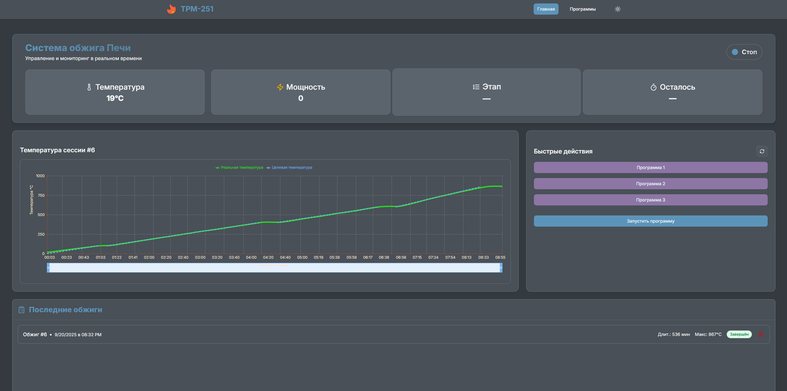
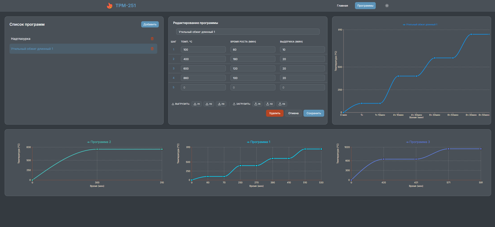

## Управление контроллером температуры ОВЕН ТРМ-251 по протоколу MODBUS
Этот проект представляет собой комплексное решение для мониторинга и управления контроллером температуры ОВЕН ТРМ-251 по протоколу Modbus.

#### **Содержание:**
- [Начало работы](#Начало-работы)
- [Автозапуск в systemd](#Автозапуск-в-systemd)
- [Интерфейс программы](#Интерфейс-программы)
---
Проект состоит из двух основных компонентов, которые запускаются в контейнерах Docker:

- Backend: Сервис, написанный на Java/Kotlin, который взаимодействует напрямую с контроллером ТРМ-251 через протокол Modbus. Он отвечает за сбор данных, обработку команд и предоставление API для фронтенда.

- Frontend: Пользовательский интерфейс, разработанный на Next.js, который отображает текущие показания с контроллера и позволяет отправлять команды управления.
---
### Начало работы
Для запуска проекта убедитесь, что у вас установлен Docker и Docker Compose.

1. **Клонируйте репозиторий:**
``` bash
git clone https://github.com/Monoramen/trm-251-firing-manager.git
cd trm-251-firing-manager
```
2. **Настройка .env файла:**
Создайте и настройте файл .env, используя example.env как шаблон. Укажите в нем параметры подключения к вашему устройству и другие необходимые переменные.

3. **Настройка файла docker-compose.yml:**
Для подключения контроллера ТРМ-251, необходимо передать USB-порт в контейнер с бэкендом. Добавьте или отредактируйте секцию devices в файле docker-compose.yml в блоке backend:

- **Для Linux**
```yaml
    devices:
      - /dev/ttyUSB0:/dev/ttyUSB0
```
Здесь /dev/ttyUSB0 — это стандартный путь к USB-устройству, которое создается при подключении USB-RS485 преобразователя. Если у вас другой путь, например /dev/ttyUSB1, укажите его.

- **Для Windows**
```yaml
    devices:
    - COM1:/dev/ttyS0
```
Здесь COM1 — это имя COM-порта, к которому подключен ваш преобразователь. Замените COM1 на имя порта вашего устройства (например, COM3, COM5).

4. Запустите все сервисы с помощью Docker Compose:
```bash
docker-compose up

sudo docker compose up --build -d #для решения проблем с доступом к устройству на linux
```
Это команда соберет образы и запустит контейнеры для бэкенда и фронтенда.

5. После запуска вы сможете получить доступ к веб-интерфейсу, перейдя по адресу http://localhost:3000 или http://localhost:8080 в вашем браузере.
---

### Автозапуск в systemd

Этот шаг позволяет настроить автоматический запуск вашего проекта при старте системы, что особенно удобно для сервера или компьютера, который работает постоянно.

1. **Проверка и изменение пути:**
Перейдите в директорию вашего проекта:

```Bash
cd trm-251-firing-manager
```
Откройте файл `trm-251-firing-manager.service` для редактирования. Убедитесь, что в нём правильно указан абсолютный путь к вашему проекту. Пример содержимого файла может выглядеть так:

```Ini
[Unit]
Description=TRM-251 Firing Manager
After=network.target

[Service]
User=your_username
WorkingDirectory=/home/your_username/trm-251-firing-manager
ExecStart=/usr/bin/docker-compose up
Restart=always

[Install]
WantedBy=multi-user.target
```
Важно: Замените your_username на имя вашего пользователя, а /home/your_username/trm-251-firing-manager — на полный путь к вашему проекту.

2. **Копирование файла сервиса:**
Скопируйте настроенный файл в системную директорию systemd:

```bash
sudo cp trm-251-firing-manager.service /etc/systemd/system/trm-251-firing-manager.service
```
3. **Включение и запуск сервиса:**
После копирования файла, необходимо сообщить systemd, что сервис должен запускаться при старте системы, а затем запустить его вручную.

```Bash
sudo systemctl enable trm-251-firing-manager.service
sudo systemctl start trm-251-firing-manager.service
```
- enable: создает символическую ссылку, чтобы сервис запускался автоматически при каждой загрузке.

- start: немедленно запускает сервис в текущей сессии.

Чтобы проверить, что сервис работает корректно, используйте команду:

```Bash
sudo systemctl status trm-251-firing-manager.service
```
---

### Интерфейс программы 
Эта страница предоставляет полный контроль над текущим процессом обжига:

- Текущее состояние: Отображает ключевые параметры, такие как температура, мощность, текущий этап и оставшееся время до завершения.

- Визуализация процесса: График в реальном времени показывает изменение температуры во время текущей сессии.

- История обжигов: Предоставляет доступ к списку последних завершенных обжигов.

- Управление: Позволяет выбрать и запустить нужную программу обжига.



На этой странице вы можете создавать и редактировать профили обжига:

- Создание и редактирование: Полный набор инструментов для создания, изменения и удаления программ.

- Загрузка/выгрузка: Можно загружать программы на контроллер ТРМ-251 и выгружать их с него.

- Визуализация профиля: Перед запуском вы можете просмотреть график выбранного профиля, чтобы оценить, как будет меняться температура на каждом этапе.


---